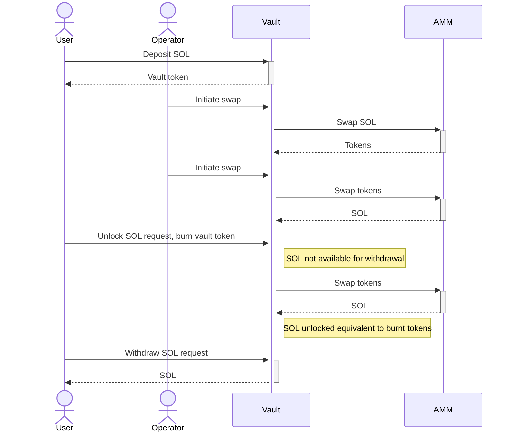
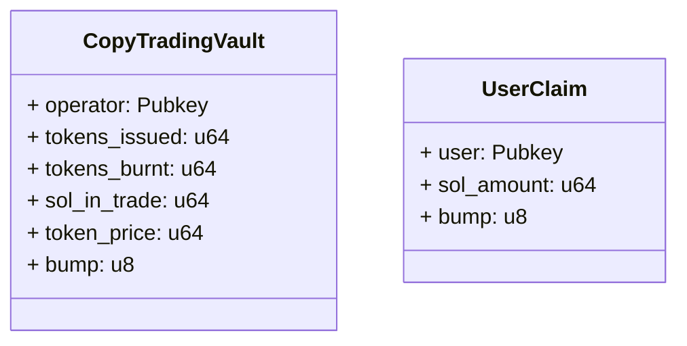
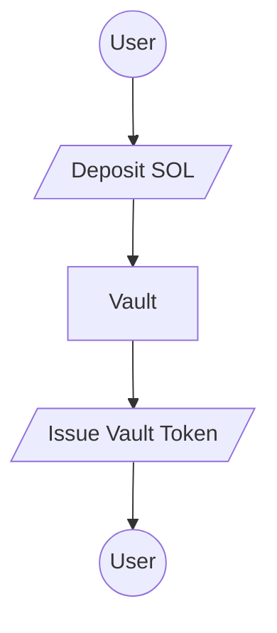
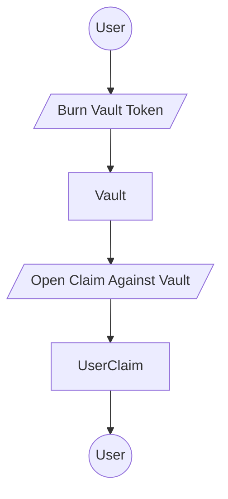
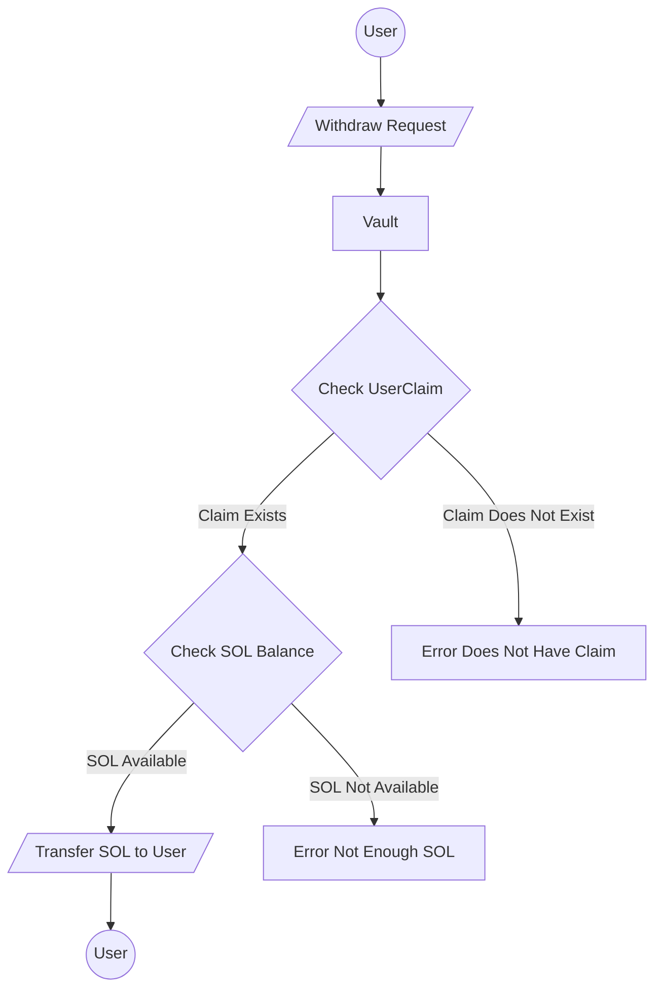
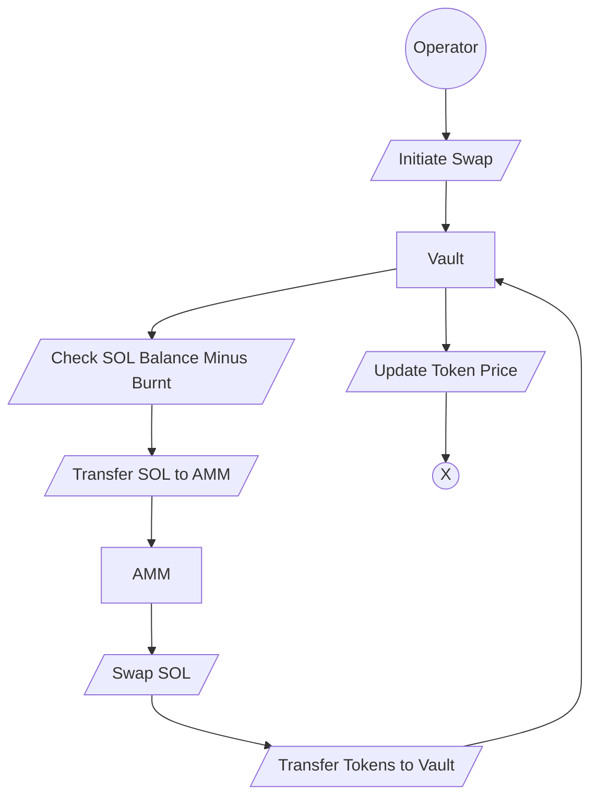
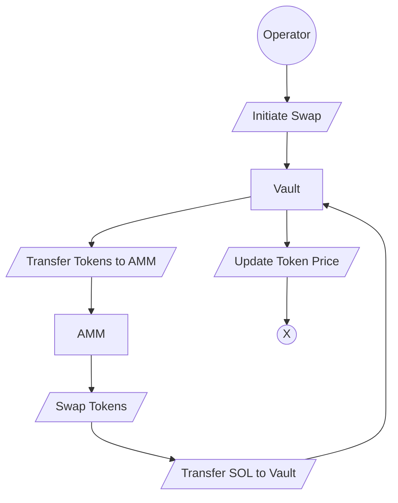

# Riseon Copy Trading Protol Requirements

## Protocol POC Requirements

1. Protocol shall allow users to deposit SOL
2. Protocol shall issue vault tokens to users
3. Protocol shall allow vault operators to swap SOL any other token
4. Protocol shall allow vault operators to swap tokens to SOL
5. Protocol shall keep a record of changes to SOL balance
6. Protocol shall allow users to initiate withdrawal of SOL by burning vault tokens
7. Protocol shall allow users to withdraw SOL when SOL is available

## Account Overview

### CopyTradingVault

The account `CopyTradingVault` is the main account for the protocol.

- `operator`: is the operator of the vault
- `tokens_issued`: is the token supply issued to users in circulation
- `tokens_burnt`: is the amount of tokens burnt BUT NOT YET WITHDRAWN
- `sol_in_trade`: is the amount of SOL in trade
- `token_price`: is the price of the token in SOL
- `bump`: unique identifier for the account

## UserClaim
The account `UserClaim` is used to keep track of the amount of SOL vault owes user after user burns his tokens.

- `user`: is the user who has a claim on the vault
- `sol_amount`: is the amount of SOL the user has a claim on
- `bump`: unique identifier for the account

## Deposit Flowcharts

## Withdraw Flowcharts

### When SOL is available

## Swap

### SOL to token swap

### Token to SOL swap

