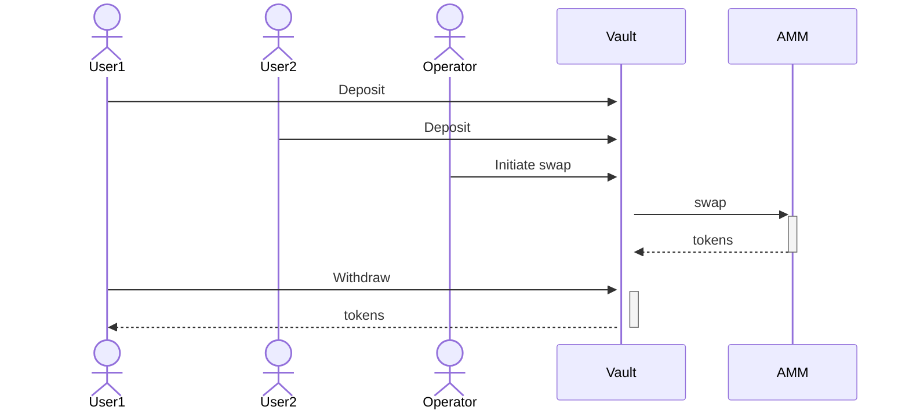
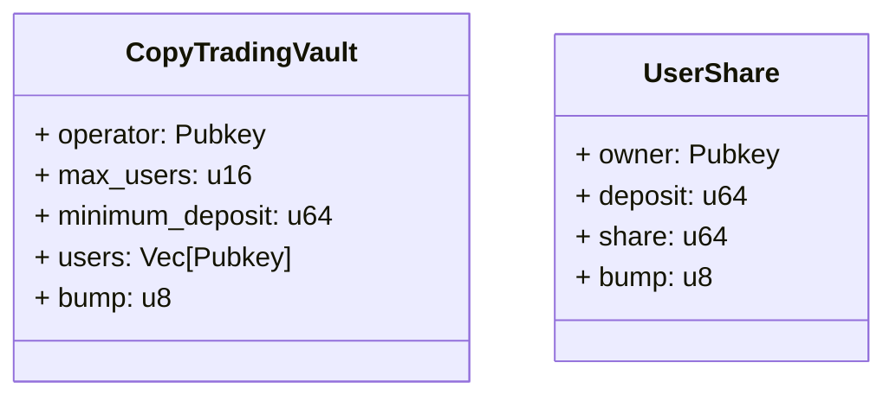
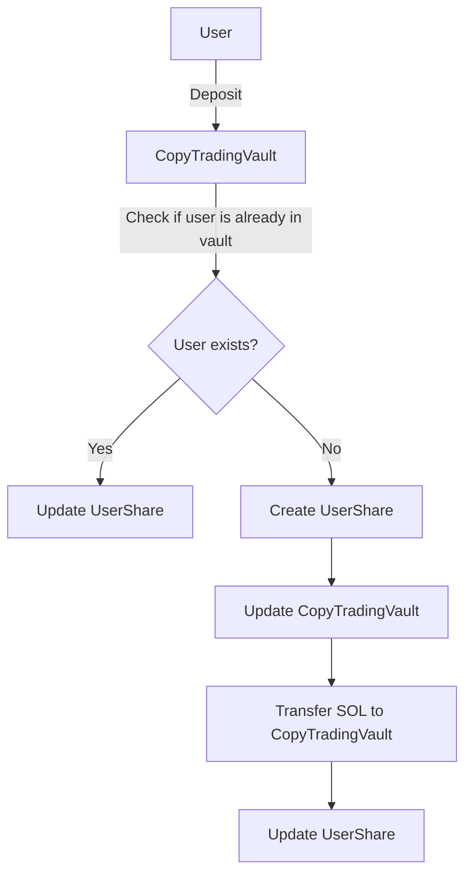
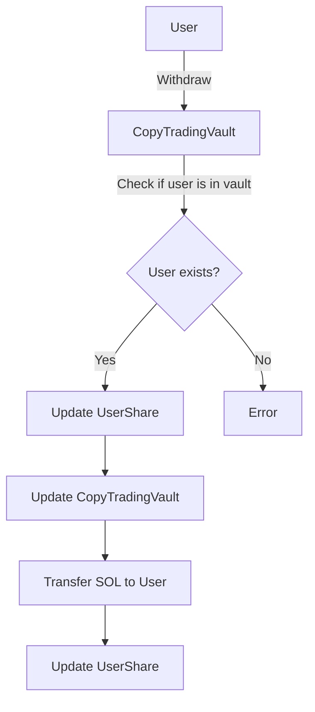
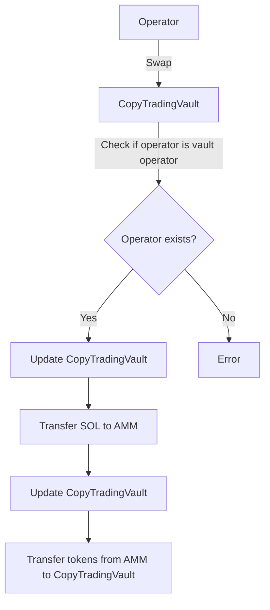

# Riseon Copy Trading Protol Requirements

## Protocol POC Requirements

1. Protocol shall allow users to deposit SOL
2. Protocol shall allow vault operators to swap SOL any other token
3. Protocol shall calculate the balance of each token to users according to their share of SOL
4. Protocol shall allow vault operators to swap tokens to SOL
5. Protocol shall calculate the balance of SOL for each user according to their share of token that was swapped
6. Protocol shall allow users to withdraw SOL

## Account Overview

### CopyTradingVault

- The account `CopyTradingVault` is the main account for the protocol. 
- The `UserShare` account is used to track the share of each user in the vault. 
- The `operator` field in the `CopyTradingVault` account is used to track the operator of the vault. 
- The `max_users` field is used to limit the number of users that can deposit into the vault. 
- The `minimum_deposit` field is used to set a minimum deposit amount for users. 
- The `users` field is used to track the users that have deposited into the vault, and verification.
- The `bump` field is used to ensure that the account is unique.

### UserShare

- The `UserShare` account is used to track the share of each user in the vault.
- The `owner` field is used to track the owner of the share.
- The `deposit` field is used to track the amount of SOL that the user has deposited into the vault.
- The `share` field is used to track the share of the user in the vault.
- The `bump` field is used to ensure that the account is unique.

## Deposit Flowcharts

## Withdraw Flowcharts

## Swap Flowcharts

