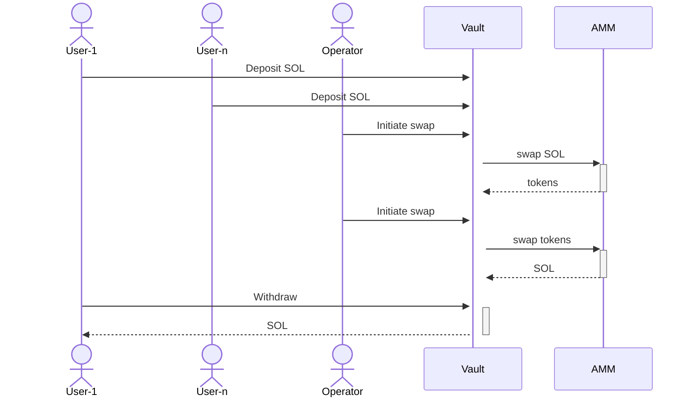
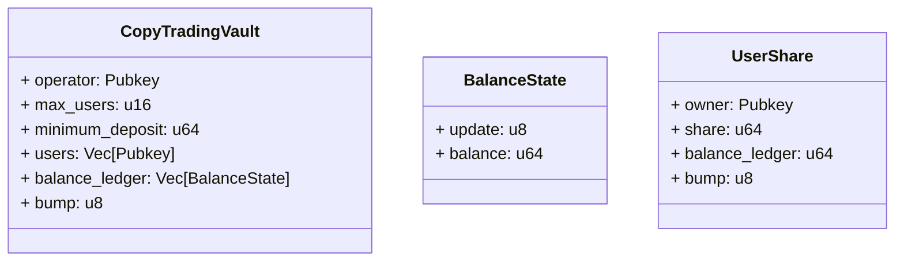
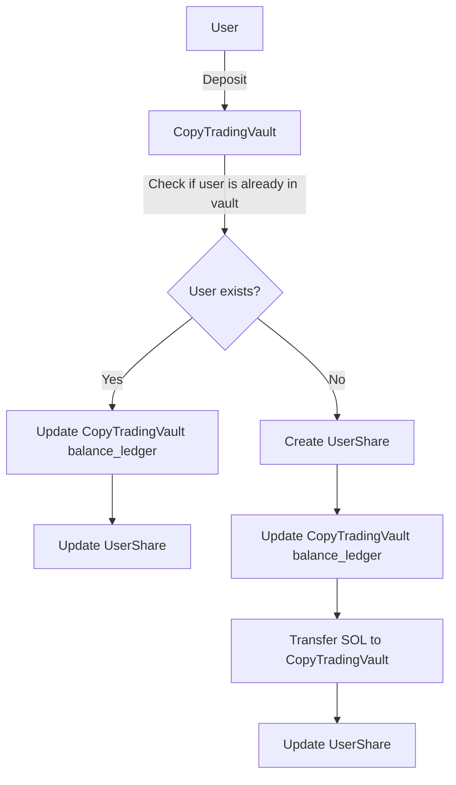
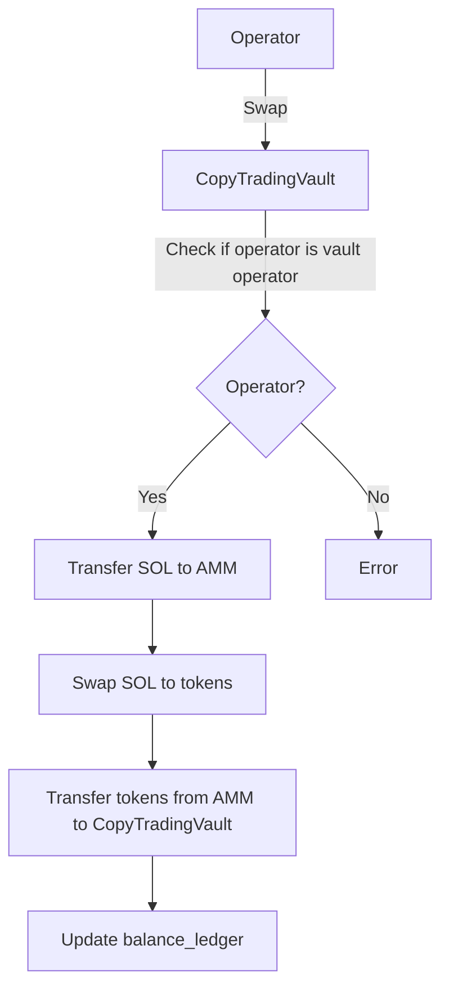
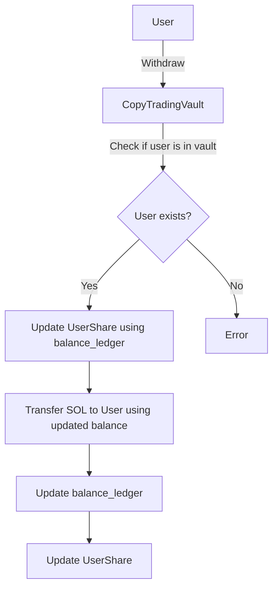

# Riseon Copy Trading Protol Requirements

## Protocol POC Requirements

1. Protocol shall allow users to deposit SOL
2. Protocol shall allow vault operators to swap SOL any other token
3. Protocol shall allow vault operators to swap tokens to SOL
4. Protocol shall keep a record of changes to SOL balance
5. Protocol shall allow users to withdraw SOL

## Account Overview

### CopyTradingVault

The account `CopyTradingVault` is the main account for the protocol.

- `operator`: is the operator of the vault
- `max_users`: maximum number of users that can deposit into the vault
- `minimum_deposit`: minimum deposit amount for users
- `users`: a list of users that have deposited into the vault
- `balance_ledger`: a list of changes to SOL balance of the vault
- `bump`: unique identifier for the account

### BalanceState

BalanceState is a data structure that tracks the changes to the SOL balance of the vault.

- `update`: the type of update (e.g., deposit, withdraw, swap represented by a u8)
- `balance`: the new balance of the vault after the update

### UserShare

The `UserShare` account is used to track the share of each user in the vault.

- `owner`: the owner of the share
- `share`: the share of user's SOL in the vault
- `balance_ledger`: the position of the user in the balance state chain
- `bump`: unique identifier for the account

## Deposit Flowcharts

- User deposits SOL and if the user is not present in the vault a UserShare account is created for the user

## Swap Flowcharts

- For tokens to SOL the flow is the same except the swap is from tokens to SOL

## Withdraw Flowcharts

- Tokens have to be converted to SOL before they can be withdrawn
